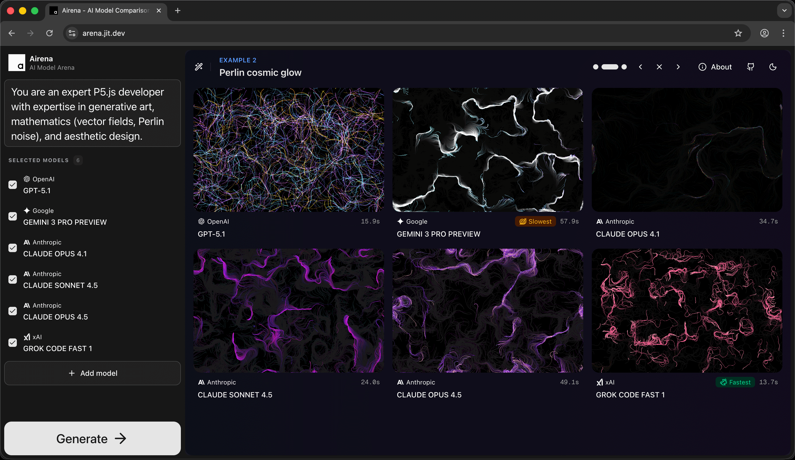
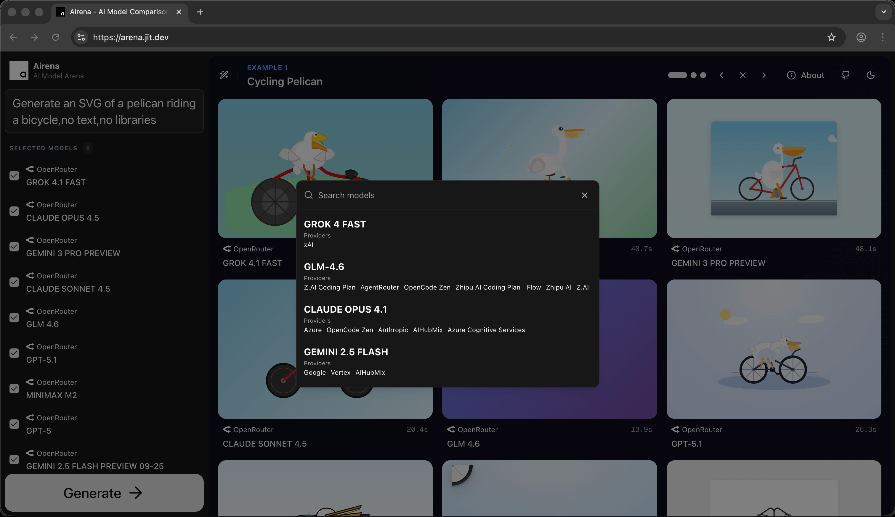

# AI Arena

[](https://opensource.org/licenses/MIT)

**The ultimate client-side LLM battleground.**

AI Arena is a powerful, open-source interface for comparing AI models side-by-side. Run prompts across **68+ providers** and **1000+ models** (including local LLMs) simultaneously to benchmark performance, speed, and quality.

**[Live Demo](https://arena.jit.dev) • [Report Bug](https://github.com/andronov04/aiarena/issues) • [Request Feature](https://github.com/andronov04/aiarena/issues)**

---

### 🎨 Creative Generation & Code

_Compare complex web-generation tasks: responsive HTML/CSS layouts, interactive JS, SVG/graphics, and more – all from a single prompt._


### ⚡ Speed & Quality Benchmarking

_Analyze latency and output quality side-by-side._


---

## ✨ Key Features

- **🤯 Massive Model Support:** Access over **1000+ models** from **68 providers** (OpenAI, Anthropic, Google, Grok, Mistral, and many more).
- **🔒 Client-Side Architecture (No Backend):** AI Arena is a frontend-only application. Your API keys and prompts are sent **directly** from your browser to the AI providers. No middleman server, no data logging, enhanced privacy.
- **⚔️ Flexible Comparison:**
  - **Cross-Model:** Compare GPT-4 vs. Claude 3.5 vs. Gemini 1.5.
  - **Cross-Provider:** Compare the same model (e.g., Llama 3) hosted on different providers (Groq vs. Fireworks vs. Local) to test latency and token speed.
- **🏠 Local LLM Support:** Seamlessly integrate with local inference servers (like Ollama or LM Studio).
- **📊 Real-time Metrics:** View generation time and performance stats for every output.

## 🏗️ Tech Stack

AI Arena is built on top of the following open-source projects:

- **[Vercel AI SDK](https://github.com/vercel/ai):** Powers the unified API interface and real-time streaming capabilities.
- **[models.dev](https://github.com/sst/models.dev):** The comprehensive registry used to source the 68+ providers and 1000+ models available in the app.

## 🚀 Getting Started

You can use the hosted version at **[arena.jit.dev](https://arena.jit.dev)** or run it locally for full control.

### Prerequisites

- Node.js (v18 or higher)
- pnpm (recommended) or yarn

### Local Installation

1.  **Clone the repository:**

    ```bash
    git clone [https://github.com/andronov04/aiarena.git](https://github.com/andronov04/aiarena.git)
    cd aiarena
    ```

2.  **Install dependencies:**

    ```bash
    pnpm install
    # or
    yarn install
    ```

3.  **Run the development server:**

    ```bash
    pnpm run dev
    # or
    yarn dev
    ```

4.  **Open your browser:**
    Navigate to `http://localhost:3000` to start comparing models.

## 🛠️ Usage

1.  **Select Models:** Click on the "Add model" button or the model dropdown to search through the extensive list of supported providers.
2.  **Configure Keys:** Since the app is client-side, you will need to input your API keys for the respective providers (saved locally in your browser).
3.  **Enter Prompt:** Type your prompt in the sidebar. You can test code generation, creative writing, or logic puzzles.
4.  **Compare:** Hit generate and watch the models stream their responses in parallel.

## 🤝 Contributing

We welcome contributions! Whether it's adding a new provider, fixing a bug, or improving the UI.

## 📄 License

Distributed under the MIT License. See `LICENSE` for more information.
